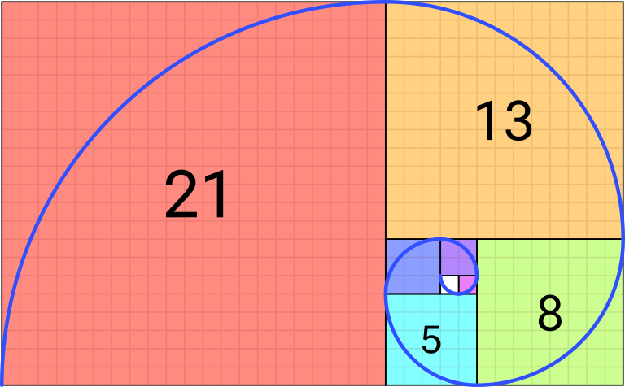

# Serie de fibonacci

En matemáticas, la sucesión o serie de Fibonacci es la siguiente sucesión infinita de números naturales:

 0, 1, 1, 2, 3, 5, 8, 13, 21, 34, ...

# Contenido

- Función finobacci
- Test con jest

# Fibonacci spiral

## Licencia
[ISC](https://es.wikipedia.org/wiki/Licencia_ISC)